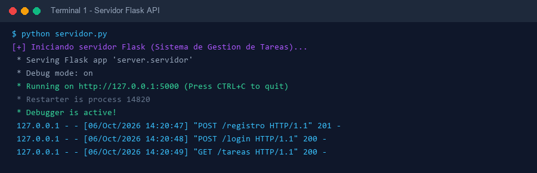
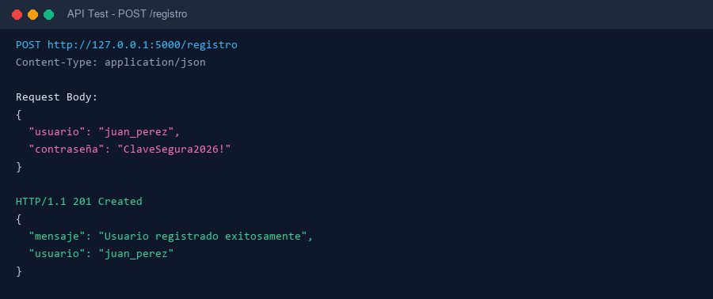
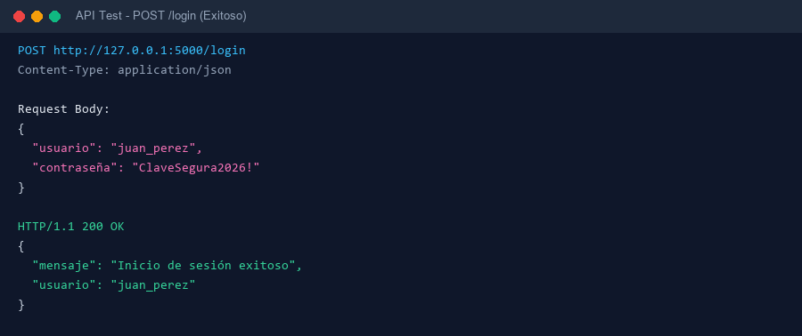
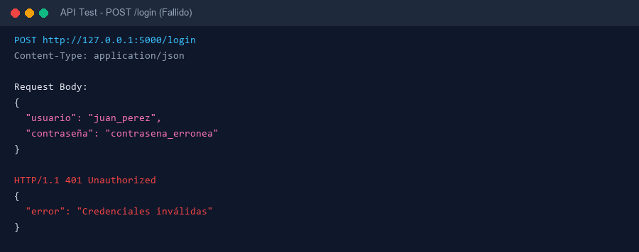
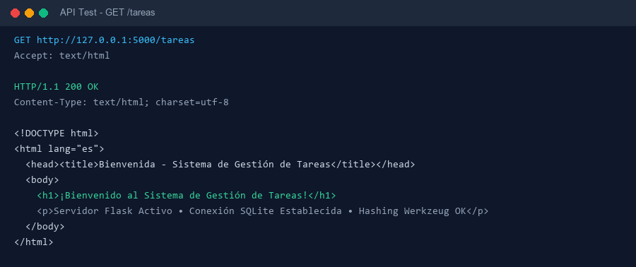
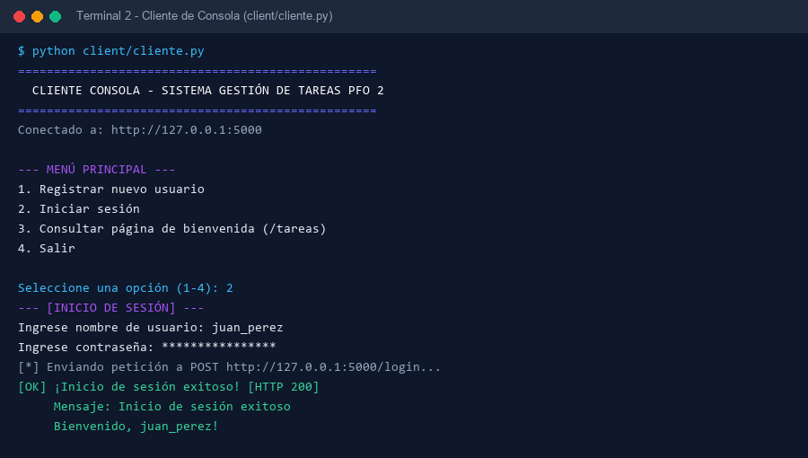
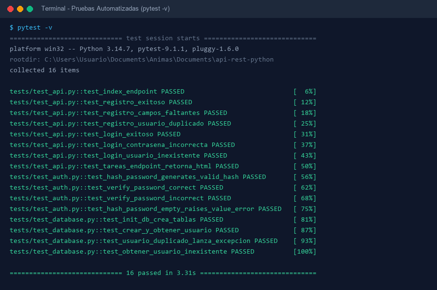
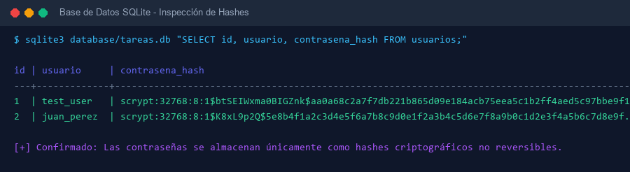

# PFO 2 — Sistema de Gestión de Tareas con API REST y Base de Datos


---

## 📋 Descripción del Proyecto

Este proyecto corresponde a la entrega del **Trabajo Práctico Obligatorio 2 (PFO 2)**: *Sistema de Gestión de Tareas con API REST y Base de Datos*.

Consiste en la implementación de una **API RESTful desarrollada con Flask** en Python, que incluye autenticación de usuarios mediante almacenamiento seguro de contraseñas (hashing criptográfico con `Werkzeug`), persistencia relacional en una base de datos **SQLite**, un endpoint que sirve una vista HTML de bienvenida al módulo de tareas, y un **cliente interactivo de consola** que consume todos los servicios expuestos.

---

## 🚀 Objetivos Cumplidos

1. **API REST Funcional:** Endpoints probados para registro de usuarios, inicio de sesión y gestión/bienvenida de tareas.
2. **Autenticación y Protección de Contraseñas:** Hashing unidireccional seguro (usando `scrypt` / `pbkdf2:sha256`) asegurando que ninguna contraseña se almacene en texto plano.
3. **Persistencia en SQLite:** Creación automatizada y gestión relacional en `database/tareas.db`.
4. **Cliente Consola Interactivo:** Aplicación de terminal (`client/cliente.py`) con menú interactivo y manejo completo de errores de red e HTTP.
5. **Alojamiento en GitHub Pages:** Sitio web interactivo de presentación integrado en el repositorio (`index.html`).

---

## 🛠️ Tecnologías Utilizadas

- **Lenguaje:** Python 3.14
- **Framework Web:** Flask 3.1.3
- **Seguridad:** Werkzeug Security (`generate_password_hash`, `check_password_hash`)
- **Base de Datos:** SQLite3
- **Pruebas Automatizadas:** Pytest 9.1.1
- **Cliente HTTP Consola:** Python `urllib.request` / `json`
- **Despliegue Web:** GitHub Pages (HTML5 / Vanilla CSS3 / JavaScript ES6)

---

## 📁 Estructura del Proyecto

```text
api-rest-python/
│
├── server/                    # Módulo principal del servidor Flask
│   ├── __init__.py
│   ├── servidor.py            # API REST (Endpoints /registro, /login, /tareas)
│   ├── database.py            # Conexión e inicialización de SQLite
│   └── auth.py                # Hashing y verificación de contraseñas
│
├── client/                    # Cliente de consola
│   └── cliente.py             # Aplicación interactiva de terminal
│
├── database/                  # Almacenamiento persistente
│   └── tareas.db              # Base de datos SQLite (se genera automáticamente)
│
├── tests/                     # Suite de pruebas automatizadas
│   ├── __init__.py
│   ├── test_api.py            # Pruebas de endpoints HTTP y respuestas
│   ├── test_auth.py           # Pruebas de hashing y contraseñas
│   └── test_database.py       # Pruebas de SQLite e inserción de datos
│
├── screenshots/               # Capturas de pantalla de evidencia
│   ├── 01_servidor_flask.png
│   ├── 02_registro_exitoso.png
│   ├── 03_login_exitoso.png
│   ├── 04_login_incorrecto.png
│   ├── 05_tareas_html.png
│   ├── 06_cliente_consola.png
│   ├── 07_tests_pytest.png
│   └── 08_sqlite_db_hashes.png
│
├── servidor.py                # Punto de entrada raíz para iniciar la API
├── index.html                 # Página interactiva alojada en GitHub Pages
├── requirements.txt           # Dependencias del proyecto
├── PLAN_DE_TRABAJO.md         # Plan de trabajo incremental detallado
├── README.md                  # Documentación oficial del proyecto
└── .gitignore                 # Exclusiones de Git
```

---

## ⚙️ Instalación y Configuración

### 1. Clonar el repositorio
```bash
git clone https://github.com/tu-usuario/api-rest-python.git
cd api-rest-python
```

### 2. Crear y activar el entorno virtual
- **En Linux / macOS:**
  ```bash
  python3 -m venv .venv
  source .venv/bin/activate
  ```
- **En Windows (PowerShell / CMD):**
  ```powershell
  python -m venv .venv
  .venv\Scripts\activate
  ```

### 3. Instalar dependencias
```bash
pip install -r requirements.txt
```

---

## 🏃 Execution Guide

### Iniciar el Servidor API Flask
Ejecutar el servidor desde la raíz del proyecto:
```bash
python servidor.py
```
El servidor se iniciará en `http://127.0.0.1:5000`.

### Ejecutar el Cliente de Consola
En una segunda terminal (con el servidor ejecutándose):
```bash
python client/cliente.py
```
Aparecerá el menú interactivo:
```text
==================================================
  CLIENTE CONSOLA - SISTEMA GESTIÓN DE TAREAS PFO 2
==================================================
Conectado a: http://127.0.0.1:5000

--- MENÚ PRINCIPAL ---
1. Registrar nuevo usuario
2. Iniciar sesión
3. Consultar página de bienvenida (/tareas)
4. Salir
```

---

## 📡 Documentación de Endpoints

### 1. Registro de Usuarios (`POST /registro`)
Registra un nuevo usuario en SQLite. La contraseña se hashea antes de almacenarla.

- **Request JSON:**
  ```json
  {
      "usuario": "juan_perez",
      "contraseña": "ClaveSegura2026!"
  }
  ```
- **Respuesta Exitosa (`201 Created`):**
  ```json
  {
      "mensaje": "Usuario registrado exitosamente",
      "usuario": "juan_perez"
  }
  ```
- **Respuesta de Error (`409 Conflict`):**
  ```json
  {
      "error": "El usuario ya existe"
  }
  ```

### 2. Inicio de Sesión (`POST /login`)
Valida las credenciales comparando la contraseña ingresada contra el hash en la base de datos.

- **Request JSON:**
  ```json
  {
      "usuario": "juan_perez",
      "contraseña": "ClaveSegura2026!"
  }
  ```
- **Respuesta Exitosa (`200 OK`):**
  ```json
  {
      "mensaje": "Inicio de sesión exitoso",
      "usuario": "juan_perez"
  }
  ```
- **Respuesta de Error (`401 Unauthorized`):**
  ```json
  {
      "error": "Credenciales inválidas"
  }
  ```

### 3. Página de Bienvenida de Tareas (`GET /tareas`)
Muestra una interfaz HTML moderna que da la bienvenida al usuario al módulo de tareas.

- **Respuesta Exitosa (`200 OK`):** `Content-Type: text/html; charset=utf-8`

---

## 🧪 Pruebas Automatizadas

Para ejecutar la suite completa de 16 pruebas automatizadas:

```bash
pytest -v
```

**Resultado de las pruebas:**
```text
tests/test_api.py::test_index_endpoint PASSED                            [  6%]
tests/test_api.py::test_registro_exitoso PASSED                          [ 12%]
tests/test_api.py::test_registro_campos_faltantes PASSED                 [ 18%]
tests/test_api.py::test_registro_usuario_duplicado PASSED                [ 25%]
tests/test_api.py::test_login_exitoso PASSED                             [ 31%]
tests/test_api.py::test_login_contrasena_incorrecta PASSED               [ 37%]
tests/test_api.py::test_login_usuario_inexistente PASSED                 [ 43%]
tests/test_api.py::test_tareas_endpoint_retorna_html PASSED              [ 50%]
tests/test_auth.py::test_hash_password_generates_valid_hash PASSED       [ 56%]
tests/test_auth.py::test_verify_password_correct PASSED                  [ 62%]
tests/test_auth.py::test_verify_password_incorrect PASSED                [ 68%]
tests/test_auth.py::test_hash_password_empty_raises_value_error PASSED   [ 75%]
tests/test_database.py::test_init_db_crea_tablas PASSED                  [ 81%]
tests/test_database.py::test_crear_y_obtener_usuario PASSED              [ 87%]
tests/test_database.py::test_usuario_duplicado_lanza_excepcion PASSED    [ 93%]
tests/test_database.py::test_obtener_usuario_inexistente PASSED          [100%]

============================= 16 passed in 3.31s ==============================
```

---

## 🧠 Respuestas Conceptuales

### 1. ¿Por qué hashear contraseñas?

Almacenar contraseñas en **texto plano** en una base de datos es una práctica de alto riesgo. Si un atacante obtiene acceso a la base de datos (por inyección SQL, respaldo expuesto o brecha de servidor), conocería de inmediato las contraseñas de todos los usuarios.

**Puntos clave:**
- **Irreversibilidad:** Las funciones de hash criptográfico (como `scrypt` o `pbkdf2:sha256`) son transformaciones unidireccionales de sentido único. Es computacionalmente inviable obtener la contraseña original a partir del hash.
- **Protección contra Rainbow Tables:** Al utilizar algoritmos modernos con *salt* (sal), contraseñas idénticas producen hashes completamente distintos, neutralizando ataques basados en tablas precalculadas.
- **Verificación sin revelación:** Durante el inicio de sesión, el servidor calcula el hash de la contraseña ingresada y lo compara con el valor en SQLite (`check_password_hash`). Si coinciden, se concede acceso sin haber necesitado almacenar o reconstruir la clave en texto plano.

### 2. Ventajas de utilizar SQLite en este proyecto

SQLite resulta la opción ideal para este proyecto por las siguientes razones:

1. **Autónoma y Cero Configuración (*Serverless*):** No requiere instalar, configurar ni mantener un servicio de servidor de base de datos independiente (como MySQL o PostgreSQL).
2. **Almacenamiento en Archivo Único:** Todo el esquema, índices y datos residen en un solo archivo plano (`database/tareas.db`), simplificando el control de versiones y la portabilidad del proyecto.
3. **Integración Nativa con Python:** Viene incluida en la biblioteca estándar (módulo `sqlite3`), garantizando compatibilidad inmediata sin instalar conectores pesados.
4. **Cumplimiento de ACID y Rapidez:** Proporciona transacciones seguras (Atomisidad, Consistencia, Aislamiento, Durabilidad) con un tiempo de respuesta sobresaliente para aplicaciones de pequeña a mediana escala.

---

## 📸 Capturas de Pantalla de Pruebas Exitosas

### 1. Servidor Flask en Ejecución


### 2. Endpoint POST /registro


### 3. Endpoint POST /login (Exitoso)


### 4. Endpoint POST /login (Credenciales Incorrectas)


### 5. Endpoint GET /tareas (Respuesta HTML)


### 6. Cliente de Consola Interactivo


### 7. Pruebas Automatizadas Pytest (16/16 Passed)


### 8. Inspección de Hashes en SQLite


---

## 🌐 Configuración de GitHub Pages

Para alojar la documentación interactiva en GitHub Pages:
1. Subir el proyecto a GitHub.
2. Ir a **Settings** > **Pages** en el repositorio.
3. En **Source**, seleccionar la rama `main` (o `master`) y la carpeta `/ (root)`.
4. Guardar cambios. El proyecto estará disponible públicamente en `https://tu-usuario.github.io/api-rest-python/`.
